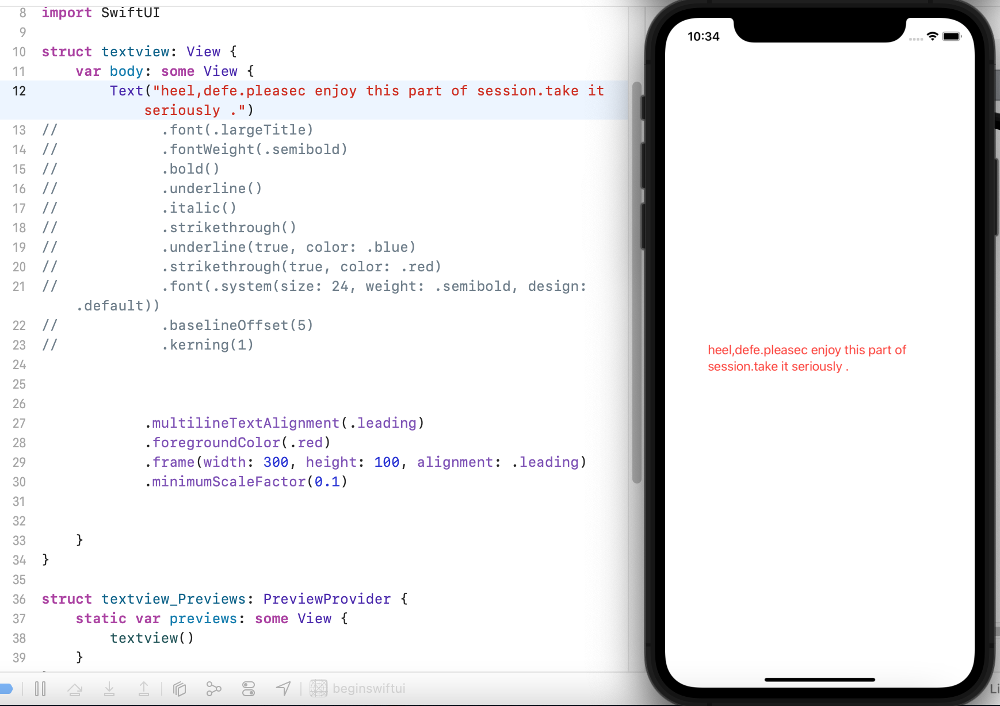

### beginswiftui
The project focuses on the basis of SwiftUI.

## Directory：


* <span id="stage1_D">stage1</span>
	- [Text](#Text)
	- [Shape](#Shape)
	- [Color](#Color)
	- [Gradient](#Gradient)
	- [Icon](#Icon)
	- [Image](#Image)
	- [Frame](#Frame)
	- [BackgroundandOverlay](#BackgroundandOverlay)


<h4 id="Text">Text</h4>


`Text` is used to display one or more lines of text content with the same effect as `UILabel`, but it is even better.

If you want to create `Text`, just create it with `Text("SwiftUI")`;
With chained syntax, you can also add multiple attributes to the text, such as fonts, colors, shadows, spacing between top left and right, and so on.

Example:

```swift

Text("SwiftUI")
    .foregroundColor(.orange)
    .bold()
    .font(.system(.largeTitle))
    .fontWeight(.medium)
    .italic()
    .shadow(color: .black, radius: 1, x: 0, y: 2)

```

<details close>
  <summary>View running results</summary>
  
</details>

[🔝](#stage1_D)

